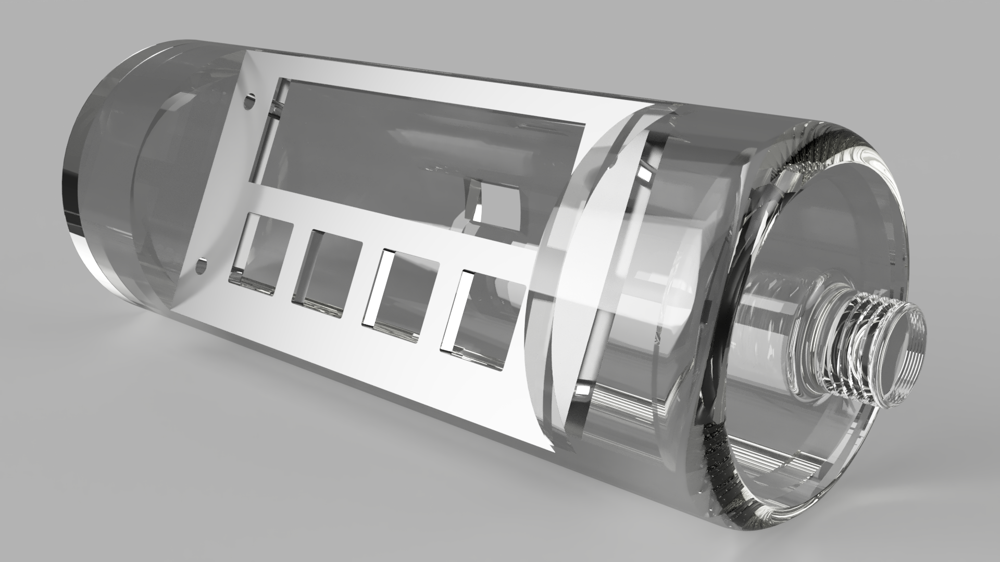
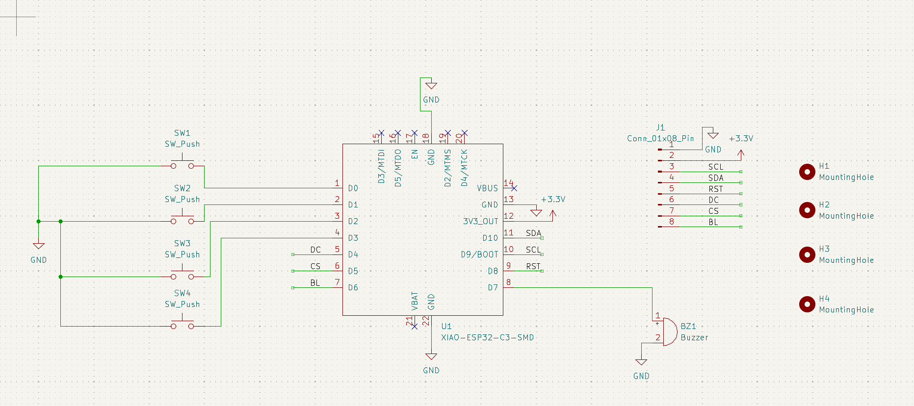
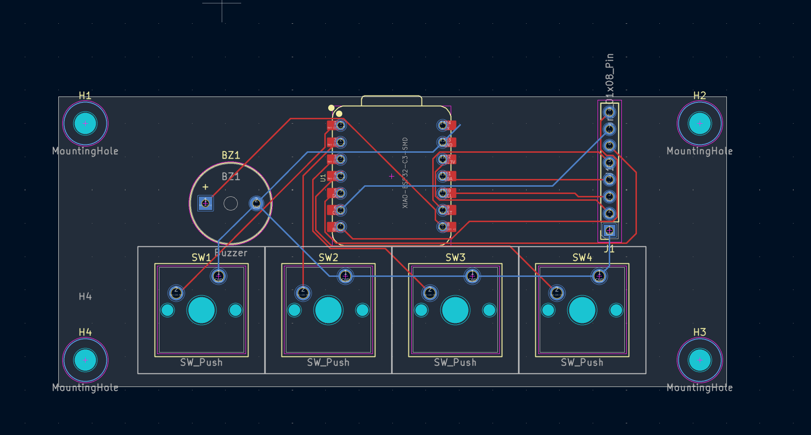

# The-Bottle-Clock
A little clock wich look like a bottle

## About :
A radio alarm clock with 4 programmable buttons, featuring an unusual bottle-like shape.
Project link : https://blare.hackclub.com/

## Features :
- A screen to look the time
- 4 programmable key for anything like change hour , minute , switch ON/OFF the screen or set a alarm 
- A compact format
- Work with usb-c micro controller

## Parts :
- 1x Seeed XIAO ESP32C3
- 4x MX-Style Keyboard Switches
- 4x White Blank DSA Keycaps
- 1x 2.25in TFT Screen
- 1x 3.3V Piezo Buzzer
- 1x 2.54mm 8 Pin Male Header (For connecting your screen + cables)
- 4x M3x8mm Screws (to link the pcb at the case)
- RTC DS3231 (very soon)

## Photos :

